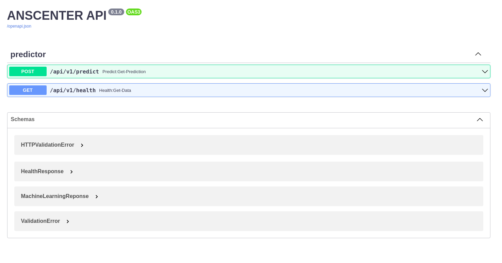

# ANNHUB Python library

Main backend module, which is used for developing web-app logic and deploying AI model by just a few lines of code.


# Usage

We develop a RESTful web controller into a reusable library between many AI models. With these functionalities: **Input model**, **Define data input**, **logging**, **exception handler**.

## Installing
Delivering and versioning as a [PyPi](https://pypi.org/) package.
Install and update using [pip](https://pip.pypa.io/en/stable/getting-started/):

```
$ pip install annhub-python
```
## A simple example
```python
from annhub_python import PyAnn

app = PyAnn()

# Define the expected AI model
app.set_model("D:\ARI\ANSCENTER\TrainedModel_c++.ann")

# Define which model ID will be used
app.set_model_id(5122020)

# Define the input corresponding to the choosen model
app.set_input_length(4)

if __name__ == "__main__":
    app.run(host = "0.0.0.0", port = 8080, debug = False)

```
## API 
The library will product two APIs: **health checking**, **predicting** as well as a [Swagger UI](https://swagger.io/) for API documentation.
```
GET: /api/v1/health
POST: /api/v1/predict
```


## Detailed Example

**Iris Prediction server**

In this example, we illustrate how to develop a server by using AI model powered by ANNHUB with only few steps. You can use this [link](examples/iris) to access our code.
The procedure of using our library to server AI model is as follows:
<ol>
<li> Put a trained model into your project folder.</li>
<li> Create main.py file, where some key information will be determined such as model path, model id, input length,... </li>
<li> Create Dockerfile to containerize your application. (We recommend to reuse our Dockerfile).</li>
<li> Create docker-compose.yml file, which will construct your docker container by a simple command line. (We also recommend to use as our instruction)</li>
<li> Run your application be a simple command line: docker-compose up -d </li>
<li> With default settings, your AI can be used at [http://localhost:8080](http://localhost:8080). You can access [http://localhost:8080/docs](http://localhost:8080/docs) to use your Swagger UI documentation. </li>

